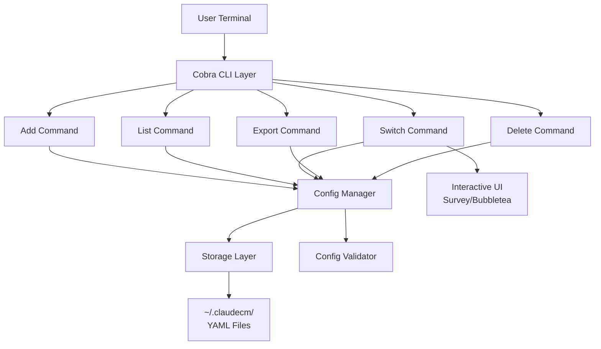
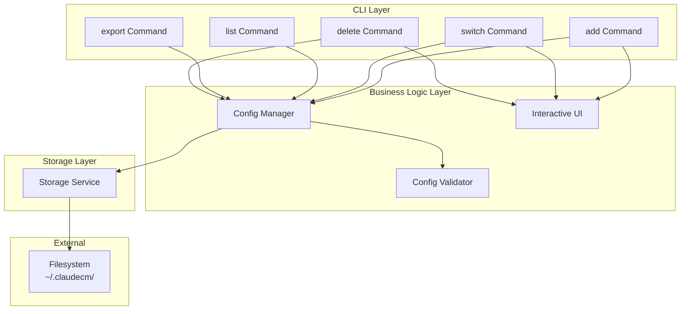
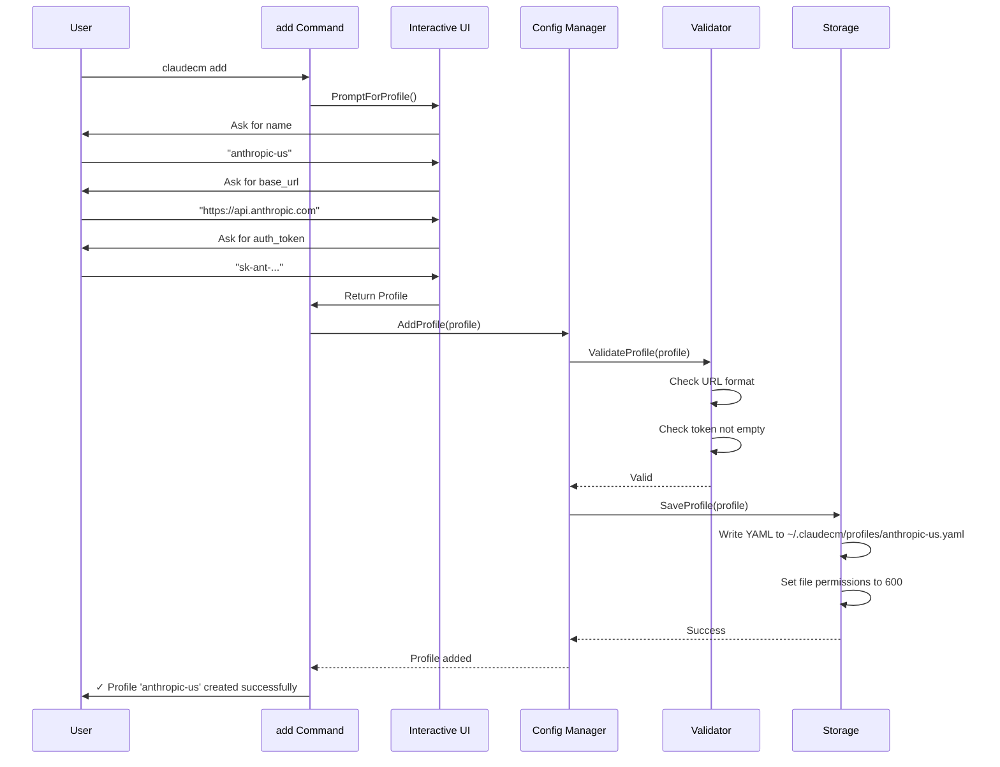
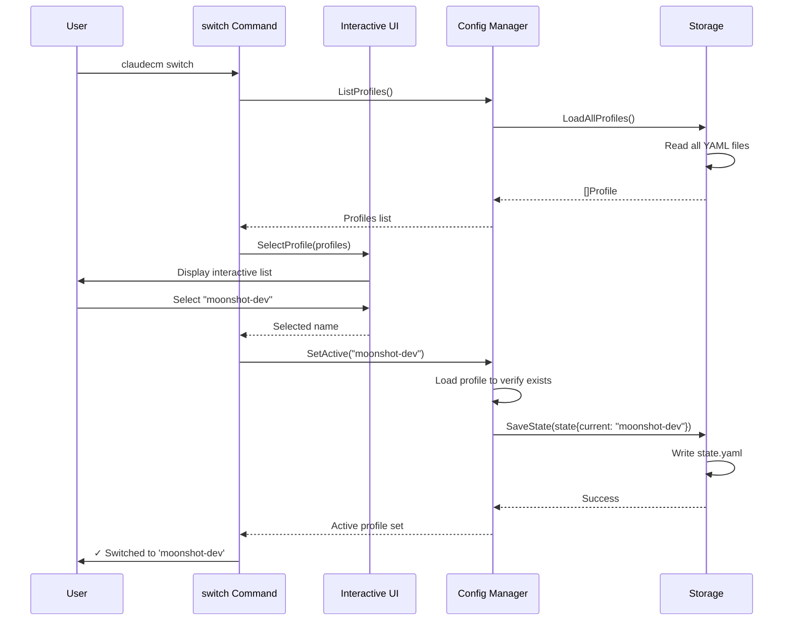
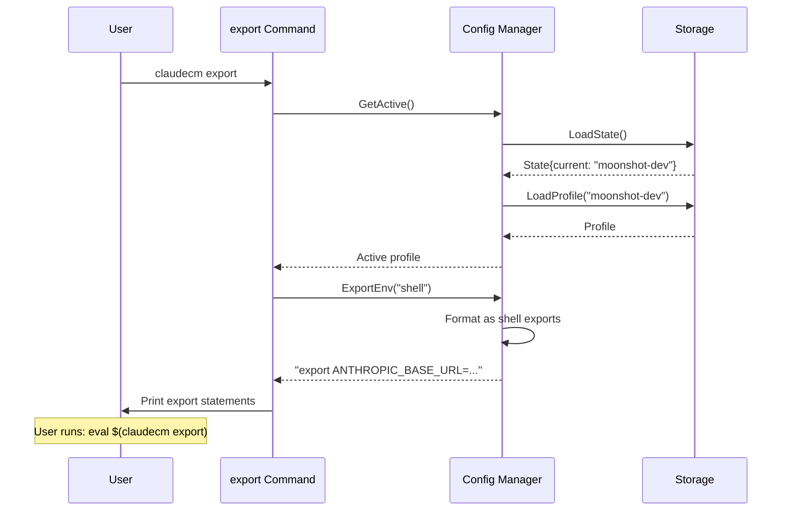

# Claude Code Environment Manager (claudecm) Architecture Document

## Introduction

This document outlines the overall project architecture for **claudecm**, a CLI tool for managing Claude Code environment configurations. The system uses Go's native capabilities to provide a fast, cross-platform environment management solution with minimal dependencies.

### Starter Template or Existing Project

**N/A - Greenfield project**

This is a brand-new Go CLI project. We'll use:
- Go 1.21+ with standard library
- Cobra for CLI framework (industry standard, used by kubectl, gh, etc.)
- Survey/Bubbletea for interactive TUI
- No starter template - following Go CLI best practices

### Change Log

| Date | Version | Description | Author |
|------|---------|-------------|--------|
| 2025-10-31 | 1.0 | Initial architecture document | Winston (Architect Agent) |

---

## High Level Architecture

### Technical Summary

Claudecm is a **standalone CLI application** built with Go, following a **layered architecture** pattern. The system consists of three main layers: CLI interface (Cobra commands), business logic (config management, encryption), and storage (local filesystem). It uses **local YAML files** for configuration storage with **file-based state management**, eliminating external dependencies. The architecture prioritizes **simplicity, performance, and security**, aligning with the PRD goals of millisecond-level switching and developer-friendly UX.

### High Level Overview

**Architecture Style:** Monolithic CLI Application
**Repository Structure:** Monorepo (single Go module)
**Service Architecture:** Local-first, no server components
**Primary Flow:**
1. User invokes command → Cobra parses and routes
2. Command layer validates input → calls business logic
3. Business logic reads/writes config files → returns result
4. Result formatted and displayed to user

**Key Decisions:**
- **Local-first:** No cloud dependencies in MVP (faster, simpler, privacy-first)
- **YAML storage:** Human-readable, git-friendly, easy to backup
- **Cobra framework:** Industry standard, excellent docs, proven in production
- **Survey for TUI:** Simple API, good UX, actively maintained

### High Level Project Diagram



### Architectural and Design Patterns

- **Command Pattern:** Each CLI command is a separate handler with clear responsibility - _Rationale:_ Cobra's idiomatic pattern, enables easy testing and command composition
- **Repository Pattern:** Abstract config storage/retrieval operations - _Rationale:_ Allows future storage backends (cloud sync) without changing business logic
- **Singleton Pattern:** Single config manager instance per execution - _Rationale:_ Ensures consistent state and prevents concurrent file access issues
- **Builder Pattern:** Config creation with validation - _Rationale:_ Fluent API for complex config objects, ensures validity before persistence
- **Strategy Pattern:** Different export formats (shell, JSON, env file) - _Rationale:_ Enables flexible output formats based on user needs

---

## Tech Stack

### Cloud Infrastructure

**N/A** - This is a local CLI tool with no cloud dependencies in MVP.

Post-MVP cloud features (sync, team sharing) will use:
- **Provider:** User-choice (GitHub Gist, AWS S3, self-hosted)
- **Key Services:** Object storage for config backup
- **Deployment Regions:** Global (client-side tool)

### Technology Stack Table

| Category | Technology | Version | Purpose | Rationale |
|----------|------------|---------|---------|-----------|
| **Language** | Go | 1.21+ | Primary development language | Fast compilation, single binary, excellent stdlib, cross-platform |
| **CLI Framework** | Cobra | 1.8.0 | Command-line interface structure | Industry standard (kubectl, gh), excellent docs, auto-help generation |
| **Interactive UI** | Survey v2 | 2.3.7 | TUI prompts and selection | Simple API, beautiful output, actively maintained |
| **Config Format** | YAML | gopkg.in/yaml.v3 | Configuration file format | Human-readable, git-friendly, Go native support |
| **File Permissions** | Unix permissions | stdlib | Secure file access (600) | Native OS integration, no external deps |
| **Testing** | Go testing | stdlib | Unit and integration tests | Built-in, fast, table-driven tests |
| **Mocking** | testify/mock | 1.9.0 | Test doubles | Simple assertions, readable mocks |
| **Build Tool** | Go build | stdlib | Compilation | Native, cross-compilation support |
| **Release Tool** | goreleaser | 1.24.0 | Multi-platform binaries | Automates builds, Homebrew formulas, checksums |
| **CI/CD** | GitHub Actions | N/A | Automated testing and release | Free for public repos, Go preinstalled, goreleaser integration |
| **Linter** | golangci-lint | 1.55.2 | Code quality | Meta-linter, fast, configurable |
| **Package Manager** | Homebrew | N/A | macOS/Linux distribution | De facto standard for CLI tools |
| **Encryption** | crypto/aes | stdlib (Post-MVP) | Config encryption | Built-in, FIPS-compliant, no external deps |

---

## Data Models

### Config Profile

**Purpose:** Represents a single Claude Code environment configuration with all necessary environment variables.

**Key Attributes:**
- `name`: string - Unique identifier for the profile (e.g., "anthropic-us", "moonshot-dev")
- `base_url`: string - API base URL (e.g., "https://api.anthropic.com")
- `auth_token`: string - API authentication token (sensitive)
- `model`: string - Default model name (e.g., "claude-sonnet-4")
- `custom_env`: map[string]string - Additional custom environment variables
- `created_at`: time.Time - Profile creation timestamp
- `updated_at`: time.Time - Last modification timestamp
- `description`: string - Optional human-readable description

**Relationships:**
- One profile is "active" at a time (stored in state file)
- Profiles are independent (no inheritance or composition in MVP)

### State File

**Purpose:** Tracks the currently active configuration profile.

**Key Attributes:**
- `current_profile`: string - Name of the active profile
- `last_switched`: time.Time - When the active profile was set
- `version`: string - State file format version (for future compatibility)

**Relationships:**
- References one Config Profile by name
- Single state file per installation

---

## Components

### CLI Command Layer

**Responsibility:** Parse user input, validate arguments, coordinate command execution, format output

**Key Interfaces:**
- `Execute()` - Cobra's entry point for each command
- `RunE(cmd *cobra.Command, args []string) error` - Command execution logic

**Dependencies:**
- Config Manager (business logic)
- Interactive UI (for interactive commands)

**Technology Stack:**
- Cobra for command parsing
- Standard error handling with exit codes
- Color output using Cobra's built-in support

### Config Manager

**Responsibility:** Core business logic for config CRUD operations, validation, and state management

**Key Interfaces:**
- `AddProfile(profile Profile) error` - Create new profile
- `ListProfiles() ([]Profile, error)` - Retrieve all profiles
- `GetProfile(name string) (Profile, error)` - Get specific profile
- `UpdateProfile(name string, profile Profile) error` - Modify existing profile
- `DeleteProfile(name string) error` - Remove profile
- `SetActive(name string) error` - Mark profile as active
- `GetActive() (Profile, error)` - Get currently active profile
- `ExportEnv(format string) (string, error)` - Generate env export statements

**Dependencies:**
- Storage Layer (persistence)
- Validator (config validation)

**Technology Stack:**
- Pure Go with standard library
- Thread-safe operations (mutex for concurrent access)

### Storage Layer

**Responsibility:** Abstract filesystem operations, handle file I/O, manage config directory structure

**Key Interfaces:**
- `SaveProfile(profile Profile) error` - Write profile to disk
- `LoadProfile(name string) (Profile, error)` - Read profile from disk
- `LoadAllProfiles() ([]Profile, error)` - Read all profiles
- `DeleteProfile(name string) error` - Remove profile file
- `SaveState(state State) error` - Write state file
- `LoadState() (State, error)` - Read state file
- `EnsureConfigDir() error` - Create ~/.claudecm if not exists

**Dependencies:**
- Filesystem (stdlib `os`, `path/filepath`)
- YAML encoder/decoder

**Technology Stack:**
- `gopkg.in/yaml.v3` for serialization
- `os.OpenFile` with 0600 permissions
- Atomic writes (write to temp file, then rename)

### Config Validator

**Responsibility:** Validate profile data before saving, ensure API URLs are well-formed, check for required fields

**Key Interfaces:**
- `ValidateProfile(profile Profile) error` - Full profile validation
- `ValidateURL(url string) error` - Check URL format
- `ValidateToken(token string) error` - Basic token format check

**Dependencies:** None (pure validation logic)

**Technology Stack:**
- `net/url` for URL parsing
- Custom validation rules
- Composable validation functions

### Interactive UI

**Responsibility:** Provide rich TUI experience for profile selection, confirmation prompts, progress indicators

**Key Interfaces:**
- `SelectProfile(profiles []Profile) (string, error)` - Interactive profile picker
- `ConfirmDelete(profileName string) (bool, error)` - Deletion confirmation
- `PromptForProfile() (Profile, error)` - Guided profile creation

**Dependencies:**
- Survey library

**Technology Stack:**
- `github.com/AlecAivazis/survey/v2`
- Color and icon support
- Keyboard navigation

### Component Diagrams



---

## External APIs

**N/A** - This CLI tool does not integrate with external APIs in the MVP phase.

Future versions may include:
- **Claude API validation** - Test connectivity when adding profiles
- **GitHub Gist API** - For cloud config sync
- **Update check API** - Notify users of new releases

---

## Core Workflows

### Workflow 1: Add New Profile



### Workflow 2: Switch Profile



### Workflow 3: Export Environment



---

## Database Schema

**N/A** - This application uses file-based storage, not a database.

### File Structure

```
~/.claudecm/
├── profiles/
│   ├── anthropic-us.yaml      # Individual profile files
│   ├── anthropic-cn.yaml
│   └── moonshot-dev.yaml
├── state.yaml                  # Current active profile
└── config.yaml                 # (Future) Global settings
```

### Profile File Format (YAML)

```yaml
name: anthropic-us
base_url: https://api.anthropic.com
auth_token: sk-ant-api03-xxxxx  # Encrypted in Post-MVP
model: claude-sonnet-4
description: "Anthropic US Production API"
custom_env:
  ANTHROPIC_TIMEOUT: "60"
  ANTHROPIC_MAX_RETRIES: "3"
created_at: 2025-10-31T10:30:00Z
updated_at: 2025-10-31T10:30:00Z
```

### State File Format (YAML)

```yaml
version: "1.0"
current_profile: anthropic-us
last_switched: 2025-10-31T10:30:00Z
```

---

## Source Tree

```plaintext
claudecm/
├── cmd/                        # Cobra command definitions
│   ├── root.go                 # Root command and global flags
│   ├── add.go                  # Add profile command
│   ├── list.go                 # List profiles command
│   ├── switch.go               # Switch active profile
│   ├── export.go               # Export environment vars
│   ├── delete.go               # Delete profile command
│   └── edit.go                 # Edit profile command
├── internal/                   # Internal packages (not importable)
│   ├── config/                 # Config management business logic
│   │   ├── manager.go          # Config manager implementation
│   │   ├── profile.go          # Profile model and methods
│   │   ├── state.go            # State model and methods
│   │   └── validator.go        # Validation logic
│   ├── storage/                # Storage layer
│   │   ├── filesystem.go       # File I/O operations
│   │   ├── yaml.go             # YAML serialization
│   │   └── paths.go            # Path construction helpers
│   ├── ui/                     # Interactive UI components
│   │   ├── prompt.go           # Survey-based prompts
│   │   ├── selector.go         # Profile selection UI
│   │   └── confirm.go          # Confirmation dialogs
│   └── export/                 # Export format handlers
│       ├── shell.go            # Shell export format
│       ├── json.go             # JSON export format
│       └── envfile.go          # .env file format
├── pkg/                        # Public packages (importable)
│   └── version/                # Version information
│       └── version.go
├── scripts/                    # Build and development scripts
│   ├── build.sh                # Local build script
│   ├── install.sh              # Local installation
│   └── test.sh                 # Run all tests
├── docs/                       # Documentation
│   ├── project-brief.md
│   ├── architecture.md         # This file
│   ├── prd.md                  # (To be created)
│   └── user-guide.md           # (To be created)
├── .github/                    # GitHub configuration
│   └── workflows/
│       ├── ci.yaml             # CI pipeline
│       └── release.yaml        # Release automation
├── .goreleaser.yaml            # GoReleaser configuration
├── .golangci.yaml              # Linter configuration
├── go.mod                      # Go module definition
├── go.sum                      # Dependency checksums
├── main.go                     # Application entry point
├── Makefile                    # Build commands
├── README.md                   # Project README
└── LICENSE                     # License file
```

---

## Infrastructure and Deployment

### Infrastructure as Code

- **Tool:** N/A (no cloud infrastructure in MVP)
- **Location:** N/A
- **Approach:** Local binary distribution

### Deployment Strategy

- **Strategy:** Pre-compiled binary distribution via package managers
- **CI/CD Platform:** GitHub Actions
- **Pipeline Configuration:** `.github/workflows/release.yaml`

**Release Process:**
1. Tag version in Git (e.g., `v1.0.0`)
2. GitHub Actions triggers goreleaser
3. Goreleaser builds for multiple platforms:
   - macOS (amd64, arm64)
   - Linux (amd64, arm64, 386)
   - Windows (amd64, 386)
4. Creates GitHub Release with binaries and checksums
5. Updates Homebrew formula automatically
6. Notifies package managers (Scoop, AUR, etc.)

### Environments

- **Development:** Developer's local machine - `go run main.go`
- **CI:** GitHub Actions runners - Automated testing on push
- **Production:** End user's machine - Installed binary via package manager

### Environment Promotion Flow

```
Developer Laptop
    ↓ (git push)
GitHub Repository
    ↓ (GitHub Actions)
Automated Build & Test
    ↓ (git tag)
Release Pipeline
    ↓ (goreleaser)
Binary Artifacts → GitHub Releases
    ↓
Package Managers (Homebrew, Scoop, etc.)
    ↓
End User Installation
```

### Rollback Strategy

- **Primary Method:** Version pinning in package managers
- **Trigger Conditions:** Critical bugs, security issues, data corruption
- **Recovery Time Objective:** < 1 hour (release hotfix, update package managers)

**Rollback Procedure:**
1. User can reinstall previous version via package manager version pinning
2. Config files are forward-compatible (can be read by older versions)
3. For critical issues: Pull broken release, push hotfix tag

---

## Error Handling Strategy

### General Approach

- **Error Model:** Go idiomatic error handling (`error` interface, sentinel errors, wrapped errors)
- **Exception Hierarchy:** N/A (Go doesn't use exceptions)
- **Error Propagation:** Return errors up the stack, wrap with context using `fmt.Errorf("context: %w", err)`

**Error Categories:**
- **User Errors:** Invalid input, missing config → Print friendly message, exit code 1
- **System Errors:** File I/O failures, permission denied → Log error, suggest fix, exit code 2
- **Internal Errors:** Unexpected conditions, bugs → Log full details, exit code 3

### Logging Standards

- **Library:** `log/slog` (Go 1.21+ structured logging)
- **Format:** JSON for machine parsing, Text for human readability
- **Levels:**
  - `DEBUG` - Detailed internal state (file operations, validation steps)
  - `INFO` - User actions (profile added, switched)
  - `WARN` - Recoverable issues (deprecated config format)
  - `ERROR` - Operation failures (file write failed)

**Required Context:**
- **Operation:** Command being executed (e.g., "add", "switch")
- **Profile Name:** Affected profile (if applicable)
- **File Path:** Affected file (for I/O errors)
- **User Context:** Environment info (OS, Go version) for bug reports

**Example:**
```go
slog.Error("failed to save profile",
    "operation", "add",
    "profile", profileName,
    "path", filePath,
    "error", err)
```

### Error Handling Patterns

#### File I/O Errors

- **Retry Policy:** No automatic retry (user action required)
- **Permission Issues:** Check file permissions, suggest `chmod` command
- **Directory Missing:** Auto-create `~/.claudecm` on first run
- **Disk Full:** Detect and report clearly, suggest cleanup

```go
if err := os.MkdirAll(configDir, 0700); err != nil {
    return fmt.Errorf("failed to create config directory %s: %w", configDir, err)
}
```

#### User Input Errors

- **Invalid Profile Name:** Check against naming rules, suggest valid format
- **Duplicate Name:** Detect and prompt user to overwrite or choose new name
- **Empty Required Fields:** Show which fields are missing

```go
if profile.Name == "" {
    return errors.New("profile name cannot be empty")
}
if !profileNameRegex.MatchString(profile.Name) {
    return errors.New("profile name must contain only letters, numbers, hyphens, and underscores")
}
```

#### Configuration Consistency

- **Missing State File:** Create default state with no active profile
- **Orphaned State Reference:** Detect and prompt user to select valid profile
- **Concurrent Modifications:** Use file locking (flock) to prevent race conditions

---

## Coding Standards

### Core Standards

- **Language & Runtime:** Go 1.21+
- **Style & Linting:**
  - `gofmt` for code formatting (enforced in CI)
  - `golangci-lint` with default rules + `gocyclo`, `goconst`, `misspell`
- **Test Organization:**
  - Test files alongside source: `manager_test.go` next to `manager.go`
  - Table-driven tests for multiple inputs
  - Integration tests in `_test` packages

### Naming Conventions

| Element | Convention | Example |
|---------|------------|---------|
| Packages | lowercase, no underscores | `config`, `storage` |
| Types | PascalCase | `Profile`, `ConfigManager` |
| Interfaces | PascalCase, often ends in -er | `Validator`, `Storage` |
| Functions | camelCase (public), camelCase (private) | `AddProfile()`, `validateURL()` |
| Constants | PascalCase or SCREAMING_SNAKE | `DefaultTimeout`, `MAX_RETRIES` |
| Files | snake_case | `config_manager.go` |

### Critical Rules

- **Error Handling:** Every function that can fail MUST return `error` - never panic in library code, only in `main()`
- **File Permissions:** All config files MUST be created with `0600` (owner read/write only)
- **Config Validation:** ALWAYS validate profiles before saving - use `validator.ValidateProfile()`, never skip
- **State Consistency:** State file MUST be updated atomically - write to temp file, then rename
- **No Global State:** Avoid package-level variables - pass dependencies explicitly (except logger)
- **Context Propagation:** Long-running operations (future network calls) MUST accept `context.Context`

**Example - Atomic File Write:**
```go
// DON'T:
func SaveProfile(profile Profile) error {
    return os.WriteFile(path, data, 0600)  // ❌ Not atomic
}

// DO:
func SaveProfile(profile Profile) error {
    tmpFile := path + ".tmp"
    if err := os.WriteFile(tmpFile, data, 0600); err != nil {
        return err
    }
    return os.Rename(tmpFile, path)  // ✅ Atomic
}
```

---

## Test Strategy and Standards

### Testing Philosophy

- **Approach:** Test-after development for MVP (speed priority), TDD for complex logic (e.g., validation, export formats)
- **Coverage Goals:**
  - Unit tests: 80%+ for business logic (`internal/config`, `internal/export`)
  - Integration tests: Happy path + error cases for CLI commands
  - E2E tests: Not in MVP (manual testing sufficient)
- **Test Pyramid:**
  - 70% unit tests (fast, isolated)
  - 25% integration tests (CLI commands with real filesystem)
  - 5% manual testing (full user workflows)

### Test Types and Organization

#### Unit Tests

- **Framework:** `testing` (stdlib)
- **File Convention:** `filename_test.go` (e.g., `manager_test.go`)
- **Location:** Same directory as source code
- **Mocking Library:** `github.com/stretchr/testify/mock` for interfaces
- **Coverage Requirement:** 80%+ for `internal/` packages

**AI Agent Requirements:**
- Generate table-driven tests for all public methods
- Cover edge cases: empty inputs, nil values, boundary conditions
- Follow AAA pattern (Arrange, Act, Assert)
- Mock filesystem using `afero` library for isolated tests

**Example:**
```go
func TestManager_AddProfile(t *testing.T) {
    tests := []struct {
        name    string
        profile Profile
        wantErr bool
        errMsg  string
    }{
        {
            name:    "valid profile",
            profile: Profile{Name: "test", BaseURL: "https://api.test.com", AuthToken: "token"},
            wantErr: false,
        },
        {
            name:    "empty name",
            profile: Profile{BaseURL: "https://api.test.com"},
            wantErr: true,
            errMsg:  "profile name cannot be empty",
        },
    }

    for _, tt := range tests {
        t.Run(tt.name, func(t *testing.T) {
            // Arrange
            mgr := NewManager(mockStorage, mockValidator)

            // Act
            err := mgr.AddProfile(tt.profile)

            // Assert
            if tt.wantErr {
                require.Error(t, err)
                require.Contains(t, err.Error(), tt.errMsg)
            } else {
                require.NoError(t, err)
            }
        })
    }
}
```

#### Integration Tests

- **Scope:** Test CLI commands with real filesystem (isolated temp directory)
- **Location:** `cmd/*_test.go` or separate `test/integration/` directory
- **Test Infrastructure:**
  - **Filesystem:** Create temp directory per test, clean up after
  - **CLI Execution:** Call command functions directly (not via subprocess)

**Example:**
```go
func TestAddCommand_Integration(t *testing.T) {
    // Setup isolated config directory
    tmpDir := t.TempDir()
    os.Setenv("HOME", tmpDir)

    // Execute add command
    cmd := NewAddCommand()
    cmd.SetArgs([]string{"--name", "test", "--base-url", "https://api.test.com", "--auth-token", "token"})
    err := cmd.Execute()
    require.NoError(t, err)

    // Verify file created
    profilePath := filepath.Join(tmpDir, ".claudecm", "profiles", "test.yaml")
    require.FileExists(t, profilePath)

    // Verify content
    data, _ := os.ReadFile(profilePath)
    var profile Profile
    yaml.Unmarshal(data, &profile)
    require.Equal(t, "test", profile.Name)
}
```

### Test Data Management

- **Strategy:** In-memory fixtures for unit tests, temp directories for integration tests
- **Fixtures:** Stored in `testdata/` subdirectories (per Go convention)
- **Factories:** Helper functions to create test profiles with sensible defaults
- **Cleanup:** Use `t.TempDir()` for automatic cleanup, `t.Cleanup()` for custom teardown

**Example Factory:**
```go
func NewTestProfile(name string) Profile {
    return Profile{
        Name:       name,
        BaseURL:    "https://api.test.com",
        AuthToken:  "test-token",
        Model:      "claude-sonnet-4",
        CustomEnv:  map[string]string{},
        CreatedAt:  time.Now(),
        UpdatedAt:  time.Now(),
    }
}
```

### Continuous Testing

- **CI Integration:**
  - Run `golangci-lint` on every PR
  - Run `go test ./...` on every push
  - Report coverage to Codecov
  - Test on multiple Go versions (1.21, 1.22, 1.23)
- **Performance Tests:** Not in MVP (CLI operations < 100ms, no need)
- **Security Tests:**
  - Run `gosec` for common security issues
  - Dependency scanning with `govulncheck`

**GitHub Actions CI Pipeline:**
```yaml
- name: Run tests
  run: |
    go test -v -race -coverprofile=coverage.out ./...
    go tool cover -func=coverage.out
```

---

## Security

### Input Validation

- **Validation Library:** Custom validators in `internal/config/validator.go`
- **Validation Location:**
  - CLI layer: Validate user input before passing to business logic
  - Config Manager: Re-validate before saving (defense in depth)
- **Required Rules:**
  - All profile names must match `^[a-zA-Z0-9_-]+$` (prevent path traversal)
  - Base URLs must be valid HTTP(S) URLs (use `url.Parse()`)
  - Auth tokens must not be empty (no format validation - provider-specific)
  - Custom env keys must not contain special chars that break shell exports

### Authentication & Authorization

**N/A** - This is a local CLI tool with no user authentication.

**File-Level Authorization:**
- Config directory (`~/.claudecm/`) created with `0700` permissions (owner only)
- Profile files created with `0600` permissions (owner read/write only)
- Prevent other users on shared systems from reading API tokens

### Secrets Management

- **Development:** Plaintext YAML in MVP (acceptable for local tool)
- **Production (Post-MVP):** AES-256 encryption for auth_token field
  - Use OS keyring (macOS Keychain, Windows Credential Manager, Linux Secret Service)
  - Encryption key derived from machine-specific data + user password
- **Code Requirements:**
  - NEVER log auth tokens (replace with `***` in logs)
  - Clear token strings from memory after use (best-effort, Go GC limitation)
  - No tokens in error messages

**Example - Redacted Logging:**
```go
func (p Profile) String() string {
    token := p.AuthToken
    if len(token) > 10 {
        token = token[:4] + "..." + token[len(token)-4:]
    }
    return fmt.Sprintf("Profile{Name: %s, BaseURL: %s, Token: %s}", p.Name, p.BaseURL, token)
}
```

### File System Security

- **Path Validation:** Prevent path traversal attacks
  - Sanitize profile names before constructing file paths
  - Use `filepath.Clean()` and `filepath.Join()` consistently
- **Symlink Attacks:** Check if target is symlink before writing
- **Atomic Operations:** Use temp file + rename to prevent partial writes
- **File Locking:** Use `flock` to prevent concurrent modifications

```go
func SafeWriteFile(path string, data []byte) error {
    // Check if path escapes config dir
    absPath, _ := filepath.Abs(path)
    if !strings.HasPrefix(absPath, configDir) {
        return errors.New("invalid path: outside config directory")
    }

    // Check for symlinks
    if fi, err := os.Lstat(path); err == nil && fi.Mode()&os.ModeSymlink != 0 {
        return errors.New("refusing to write to symlink")
    }

    // Atomic write
    tmpPath := path + ".tmp"
    if err := os.WriteFile(tmpPath, data, 0600); err != nil {
        return err
    }
    return os.Rename(tmpPath, path)
}
```

### Dependency Security

- **Scanning Tool:** `govulncheck` (official Go vulnerability scanner)
- **Update Policy:** Review dependencies monthly, update for security issues immediately
- **Approval Process:**
  - Minimize dependencies (prefer stdlib)
  - New dependencies require justification (document in PR)
  - Check license compatibility (prefer MIT, Apache 2.0, BSD)

**Minimal Dependency List:**
- `github.com/spf13/cobra` - CLI framework (essential)
- `github.com/AlecAivazis/survey/v2` - Interactive UI (essential)
- `gopkg.in/yaml.v3` - YAML parsing (could use stdlib JSON, but YAML is more user-friendly)
- `github.com/stretchr/testify` - Testing only (dev dependency)

### Security Testing

- **SAST Tool:** `gosec` - Scans for common Go security issues (hardcoded credentials, weak crypto, etc.)
- **DAST Tool:** N/A (no running service to test)
- **Penetration Testing:** N/A for MVP (local tool, no network exposure)

**CI Security Checks:**
```yaml
- name: Run gosec
  run: gosec -exclude=G104 ./...

- name: Check for vulnerabilities
  run: govulncheck ./...
```

---

## Next Steps

### Immediate Actions (Ready to start development)

1. **Initialize Go Module:**
   ```bash
   go mod init github.com/a2d2-dev/claudecm
   go get github.com/spf13/cobra@v1.8.0
   go get github.com/AlecAivazis/survey/v2@v2.3.7
   go get gopkg.in/yaml.v3
   ```

2. **Create Project Structure:**
   ```bash
   mkdir -p cmd internal/{config,storage,ui,export} pkg/version docs scripts .github/workflows
   ```

3. **Set Up Development Environment:**
   - Create `Makefile` with `build`, `test`, `lint`, `install` targets
   - Configure `.golangci.yaml` with recommended linters
   - Set up GitHub Actions for CI (lint + test)

4. **Begin Story Implementation:**
   - Use **Dev Agent** with this architecture document
   - Start with Epic 1 (Core CLI Framework)
   - Implement stories in priority order

5. **First Milestone - Basic CRUD:**
   - `claudecm add` (interactive profile creation)
   - `claudecm list` (display all profiles)
   - `claudecm delete` (remove profile)
   - Validate with manual testing

---

**Document Status:** ✅ Ready for Development
**Approval:** Pending user confirmation
**Next Agent:** Dev Agent (to implement stories)
