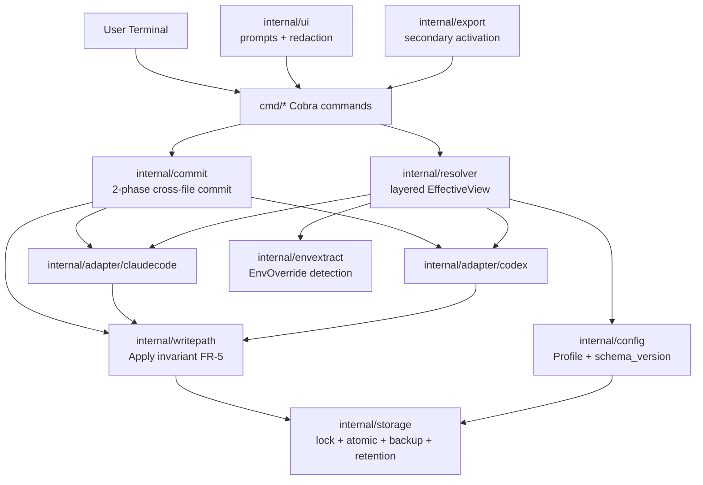

# claudecm Architecture (v1)

> **Authority.** This document is subordinate to:
> 1. `docs/decisions/0001-direction-lock.md` (ADR-0001).
> 2. `docs/prd/prd-v1.md` (canonical PRD mirror).
>
> Where this file disagrees with either, those win and this file is the bug. The architect's job is to make those documents mechanical: concrete packages, concrete interfaces, concrete invariants — no hand-waving.

## Change Log

| Date | Version | Description | Author |
|------|---------|-------------|--------|
| 2025-10-31 | 0.1 | Initial pre-ADR draft | Winston |
| 2026-07-01 | 1.0 | Rewrite aligned to ADR-0001 + PRD v1 (FR-1..FR-16, NFR-S/C/R/E/M/T) | Architect |

## 0. Scope Boundary (mirror of ADR-0001 §Locked Decisions)

In v1, claudecm is:
- A local-first Go CLI under module path `github.com/a2d2-dev/claudecm`.
- A profile manager for **exactly two** AI coding tools: **Claude Code** and **Codex CLI**.
- Plaintext YAML profile storage at `~/.claudecm/` (`0700` dir, `0600` files). **No** encryption. **No** cryptographic claims anywhere in code, docs, or marketing.
- Primary activation = direct write to the tool's on-disk config file, routed through the locked write-path invariant (PRD FR-5). Secondary activation = `export` emits shell `export VAR=...` lines.

Out for v1 (architecture must not host code for any of these): Gemini CLI / Cursor / Windsurf / IDE plugins, MCP server management, Skills management, cloud sync, team sharing, RBAC, SSO, audit/cost dashboards, GUI/TUI, proxy/failover/load balancing, project-scope `.claude/settings*.json`, built-in encryption.

## 1. High-Level Shape



The flow that matters: a write command (`switch`, `import`, `edit`, `restore`, sometimes `add`) calls the adapter to produce a `WritePlan` per owned file, the commit package orders those plans into a two-phase commit, and every individual file write goes through `writepath.Apply`. There is no other path to disk for tool-config files. The CLI shell is thin — Cobra glue, prompts, formatting.

## 2. Data Model

### 2.1 Profile

The Profile is the canonical user-facing unit. Stored as YAML, one file per profile under `~/.claudecm/profiles/<name>.yaml`. Schema (Go, illustrative; field names match the YAML form via `yaml:""` tags):

```go
type Profile struct {
    SchemaVersion int                  // required, must be 1; rejected on read if missing/unknown
    Name          string
    Description   string
    CreatedAt     time.Time
    UpdatedAt     time.Time
    Core          CoreConfig
    Tools         map[ToolID]ToolOverlay // sparse: only the tools the user actually overrides
}

type CoreConfig struct {
    Provider       string
    BaseURL        string
    APIKey         string   // plaintext in v1, redacted on display unless --reveal
    Model          string
    SmallFastModel string
    ExtraEnv       map[string]string // extra pass-through env, scoped per resolver allowlist
}

type ToolOverlay struct {
    BaseURL        string
    APIKey         string
    Model          string
    SmallFastModel string
    ExtraEnv       map[string]string
    Raw            map[string]any // tool-private overlay knobs, opaque to core
}

type ToolID string // "claude_code" | "codex"
```

Rules:
- `SchemaVersion == 1` is required. Missing → reject (NFR-S4). `>= 2` → refuse with "newer claudecm wrote this" (NFR-M1).
- Overlays are sparse: an absent field means "fall through to Core". An explicitly empty string is treated as "reset to default" under overlay-as-truth (NFR-S6).
- `Raw` is the escape hatch for tool-specific keys not yet promoted into the typed overlay. The adapter decides which `Raw` keys it consumes; everything else is preserved verbatim in the on-disk file via merge-preserve.

### 2.2 State

`~/.claudecm/state.yaml`:

```go
type State struct {
    SchemaVersion    int                              // 1
    ActiveProfile    string                            // may be "" after a delete of the previously active profile (FR-2)
    LastSwitched     time.Time
    LastAppliedPerTool map[ToolID]AppliedFingerprint // populated only for tools the active profile actually wrote to
}

type AppliedFingerprint struct {
    File      string    // owned-file path that was written (e.g., ~/.claude/settings.json)
    SHA256    string    // hash of the bytes claudecm wrote after rename
    AppliedAt time.Time
}
```

Use cases:
- `current` and `explain` re-hash each owned file at read time; mismatch with `LastAppliedPerTool[tool].SHA256` is reported as **external drift** ("file changed since last switch by something other than claudecm"). This is informational, never an automatic action.
- After `delete` of the active profile, `ActiveProfile` is cleared (FR-2 consequence).

## 3. Adapter Abstraction (`internal/adapter/`)

Adapters are the only modules that know a specific tool's file format. They are pure (read input bytes, return output structures) up to the point of handing a `WritePlan` to `internal/writepath`. The adapter never touches disk directly for owned files.

```go
type Adapter interface {
    ID() ToolID
    Detect() (Presence, error)

    // Files lists every on-disk file claudecm owns for this tool, with format and
    // the frozen owned-key allowlist for each file. This drives merge-preserve.
    Files() []OwnedFile

    // Import reads the current on-disk owned files and produces (a) the core
    // intent the user appears to be running and (b) a candidate overlay capturing
    // tool-specific deviations.
    Import(Files) (CoreFromTool, OverlayFromTool, error)

    // Plan is pure: read current bytes, parse, diff against the rendered profile,
    // and produce a per-file WritePlan. NO writes happen here. Plan is what
    // powers --dry-run and the FR-4 pre-apply diff.
    Plan(Profile) (WritePlan, error)

    // Apply hands each per-file plan to internal/writepath.Apply through the
    // two-phase commit (internal/commit). The adapter never opens a file for
    // writing itself.
    Apply(WritePlan) (ApplyReport, error)

    // Project renders what the tool will effectively see, layered through the
    // resolver. Used by `current` and `explain`.
    Project(Profile) (EffectiveView, error)
}

type OwnedFile struct {
    Path        string       // e.g. "~/.claude/settings.json" (~/ expanded via storage/paths)
    Format      FileFormat   // JSON | JSONC | TOML
    OwnedKeys   []KeyPath    // frozen allowlist (e.g. ["env.ANTHROPIC_API_KEY", ...])
}
```

### 3.1 Adapter packages in v1

- `internal/adapter/claudecode`
  - Owned file: `~/.claude/settings.json` (user scope only — project-scope `.claude/settings.json` and `.claude/settings.local.json` are explicitly out of scope for v1 per PRD §4.7 / §5).
  - Owned-key allowlist (frozen, declared as a Go `var`, mirrors PRD §4.7):
    - `env.ANTHROPIC_API_KEY`
    - `env.ANTHROPIC_BASE_URL`
    - `env.ANTHROPIC_AUTH_TOKEN`
    - `env.ANTHROPIC_MODEL`
    - `env.ANTHROPIC_SMALL_FAST_MODEL`
    - `env.CLAUDE_CODE_USE_BEDROCK`
    - `env.CLAUDE_CODE_USE_VERTEX`
  - All other keys (`permissions`, `hooks`, `mcpServers`, `model`, `theme`, …) are preserved verbatim via merge-preserve. Touching them is a bug.

- `internal/adapter/codex`
  - Owned files: `~/.codex/config.toml` and `~/.codex/auth.json`.
  - Owned-key allowlist for `config.toml`:
    - `model`
    - `model_provider`
    - `model_providers.<name>.base_url`
    - `model_providers.<name>.wire_api`
    - `model_providers.<name>.env_key`
    - `model_providers.<name>.name`
  - Owned-key allowlist for `auth.json`:
    - `OPENAI_API_KEY`
    - The exact top-level fields Codex CLI uses for current-user auth state (frozen in code; expanded in the adapter's `var ownedAuthKeys`).

### 3.2 What ships in this PR

This PR ships the **adapter interface contract and package skeletons only**. No business logic, no Go files added — those land in subsequent dev stories under the contract enforced here. The interface above and the owned-key allowlists above are the contract those stories must implement.

## 4. Write-Path Invariant (`internal/writepath/`)

A single function — `writepath.Apply(plan WritePlan) (ApplyReport, error)` — is the only path to disk for any tool-owned file. PRD FR-5 is encoded mechanically here. Bypassing this function is a coding-standards violation (see `architecture/coding-standards.md`).

Pipeline (must execute in order):

1. **Lock.** Acquire `flock(LOCK_EX)` on the target file path. Timeout = 5s (`--lock-timeout` overrides). Timeout → return `ErrLockBusy` with the path. (NFR-C1)
2. **Read.** Read current bytes. Record `size`, `mtime`, `sha256(content)` as the concurrency fingerprint.
3. **Parse.** Use the file's format-aware parser (TOML doc-model for `.toml`, JSON-preserve for `.json`/JSONC). Unparseable → abort, no backup, no write (NFR-S1). No fallback rewriting, ever.
4. **Resolve symlink.** Follow symlinks on the target; the resolved path is the actual write/backup target. If the resolved target is outside `$HOME` (or `--home`), refuse with the resolved path in the error (NFR-S2).
5. **Diff.** Compute diff vs. the rendered profile, restricted to the file's owned-key allowlist. This diff is what `--dry-run` prints and what `switch`'s FR-4 pre-apply confirmation shows.
6. **Backup.** Copy the original bytes to `~/.claudecm/backups/<tool>/<file-basename>.bak.<ISO8601>.<short-uuid>`, mode `0600`. Verify backup size matches before continuing. The backup contains the pre-write bytes, untransformed.
7. **Atomic write.** Marshal merged content (owned keys overwritten, non-owned keys preserved). Write to `<file>.tmp.<pid>.<rand>` in the same directory as the resolved target (so `rename(2)` stays on one filesystem), `fsync`, then `rename` over the target. First write against a missing target uses `O_CREAT|O_EXCL` on the temp file; if the target appears between read and rename, abort as concurrent-edit (NFR-C3).
8. **Post-write reparse.** Read the file back, parse it, and check every owned key has the intended value. If parse fails or any owned key drifted from intent → **AUTO-ROLLBACK**: `rename` the FR-5 step-6 backup over the target, mark the backup as primary, return an error that names the failed key.
9. **Concurrency check.** Before the step-7 rename, re-stat the target and re-hash it. If `size`/`mtime`/`sha256` differ from the step-2 fingerprint → abort, keep the backup, return `ErrConcurrentEdit` pointing at the backup path (NFR-C2). Exit code 2.
10. **Release lock.** Always release, including on error.

Retention (NFR-R1/R2/R3): after a successful post-write reparse, prune oldest-first down to N=10 per `(tool, file)`. `--retention <int>` overrides. Every prune writes an entry to `~/.claudecm/audit.log` (mode `0600`). Pruning only matches `<owned-file-basename>.bak.*`; it never touches the just-written file or unknown files.

Crash safety: at every step, either the original file is intact or a recoverable backup exists at a known path. No partial/truncated file is ever observable. Backups are always created **before** the atomic rename.

## 5. Two-Phase Cross-File Commit (`internal/commit/`)

A `switch` touching multiple files (Codex `auth.json` + Codex `config.toml` + Claude Code `settings.json`) is coordinated through a two-phase commit. PRD FR-16.

```go
type Commit interface {
    Stage(plans []WritePlan) (StagedTxn, error)        // phase 1: steps 1..7 of writepath, defer rename
    Commit(StagedTxn) (CommitReport, error)            // phase 2: rename in order; auto-rollback on failure
}
```

Commit order — **auth first**, so any downstream failure leaves credentials self-consistent:

1. `~/.codex/auth.json`
2. `~/.codex/config.toml`
3. `~/.claude/settings.json`

Lock acquisition follows the same order; lock release is in reverse (avoids lock-order inversion, NFR-C1).

On phase-2 failure (rename failure OR post-write reparse failure on any file): restore every already-committed target from its FR-5 step-6 backup using `rename`-over-target. Then return a structured `PartialFailure` enumerating per-file status — `committed`, `rolled-back`, `untouched` — with each backup path. Never leave a half-switched state.

## 6. Resolver (`internal/resolver/`)

The resolver answers two questions:
- "What value will the tool actually see for field X?" (`current`)
- "Why?" (`explain`)

Layer order, lowest to highest precedence (PRD FR-7):

1. Built-in default (hard-coded per adapter).
2. Profile core.
3. Profile overlay (per tool).
4. On-disk tool config (the merged file the adapter just rendered + preserved).
5. **EnvOverride** — enumerated environment variables, per-tool allowlist below.

```go
type EffectiveView struct {
    Tool   ToolID
    Fields []EffectiveField
}

type EffectiveField struct {
    Key            string        // e.g. "model", "base_url"
    Value          string        // redacted by default for `secret: true` fields (NFR-S8)
    WinningLayer   Layer         // EnvOverride | OnDiskToolConfig | ProfileOverlay | ProfileCore | BuiltInDefault
    Source         string        // file path or env var name backing the winning layer
    ShadowedLayers []ShadowEntry // every lower layer that also had a value, in precedence order
}
```

### 6.1 EnvOverride allowlist (NFR-E1)

The EnvOverride layer considers **only** these variables. Anything else is ignored by `explain` (it may surface under `explain --all-env` as diagnostic-only, never shadowing). Allowlists are exported as a single Go `var` per adapter and exercised by the CI fixture matrix.

- **Claude Code:** `ANTHROPIC_API_KEY`, `ANTHROPIC_AUTH_TOKEN`, `ANTHROPIC_BASE_URL`, `ANTHROPIC_MODEL`, `ANTHROPIC_SMALL_FAST_MODEL`, `CLAUDE_CODE_USE_BEDROCK`, `CLAUDE_CODE_USE_VERTEX`.
- **Codex CLI:** `OPENAI_API_KEY`, `OPENAI_BASE_URL`, `CODEX_HOME`, `CODEX_MODEL`, `CODEX_MODEL_PROVIDER`.

`internal/envextract` is the package the resolver calls into to read these variables. It already exists and is kept; the resolver uses it as a sub-component rather than re-implementing the lookup.

### 6.2 External drift

`Project` cross-checks the on-disk SHA256 of each owned file against `State.LastAppliedPerTool[tool].SHA256`. Mismatch is reported in `EffectiveView` as `ExternalDriftDetected = true` plus the offending file path. `explain` surfaces this prominently; `current` shows it as a one-line warning.

## 7. CLI Surface (`cmd/`)

Locked at PRD §4.6. Every file in `cmd/` corresponds to one command; `root.go` wires global flags.

| Command | Mutates | Notes |
|---------|---------|-------|
| `add` | profile store; tool files if it activates | `--dry-run`; activation path goes through commit + writepath |
| `list` | no | Default redaction of `api_key`; `--output json`; `--reveal` |
| `current` | no | Shows active profile + per-tool effective summary; reports external drift |
| `switch <name>` | tool files | `--dry-run`; `--yes`; pre-apply diff via Plan; routed through `commit.Commit` |
| `explain` | no | Full resolution chain incl. shadowed layers |
| `import claude-code` / `import codex` | profile store; sometimes tool files | `--name`, `--yes`, `--overwrite`, `--dry-run` |
| `export` | no | Emits `export VAR=...`; `--format yaml`; `--redact` (off by default) |
| `edit` | profile store; tool files if active | Default UX = `$EDITOR` on temp copy with re-parse-on-save; also `--set key=value` (repeatable); `--dry-run` |
| `rename` | profile store | Validated against profile-name regex |
| `delete` | profile store | Confirmation required; `--yes`; clears active pointer if needed |
| `restore --tool <id>` | tool files | `--list`, `--latest`, `--id`, `--dry-run`, `--yes`; routed through writepath (each restore creates its own backup of the file it overwrites) |
| `completion [bash\|zsh\|fish\|powershell]` | no | Profile names tab-complete via the storage layer |
| `version` | no | semver + commit + build date from `pkg/version` |

Global flags on `root.go`:
- `--home <path>` — overrides `$HOME` derivation; storage layer validates the override is an existing absolute path owned by the current user (NFR-S3).
- `--lock-timeout <duration>` — overrides the 5s flock timeout.
- `--retention <int>` — overrides the per-invocation backup retention.
- `--reveal` — opts out of secret redaction in `list`, `current`, `explain`.

Confirmation rules:
- `switch` requires `--yes` (or interactive `y/N`) when the pre-apply diff touches keys claudecm does not own, OR when `--strict` is passed. In non-interactive contexts without `--yes`, `switch` aborts.
- Every write command supports `--dry-run` (FR-15). Read-only commands accept `--dry-run` as a no-op for uniform scripting.

## 8. Storage (`internal/storage/` and `~/.claudecm/`)

Layout on disk:

```
~/.claudecm/
├── profiles/<name>.yaml         # one profile per file
├── state.yaml                    # active profile + LastAppliedPerTool fingerprints
├── backups/
│   ├── claude_code/
│   │   └── settings.json.bak.<ISO8601>.<uuid>
│   └── codex/
│       ├── config.toml.bak.<ISO8601>.<uuid>
│       └── auth.json.bak.<ISO8601>.<uuid>
└── audit.log                     # retention pruning audit (mode 0600)
```

- Directory mode `0700`. Every file mode `0600`. Enforced at creation, re-asserted on every write.
- Profile YAML carries `schema_version: 1` (required). Missing → reject. `>= 2` → refuse-on-unknown-future-version (NFR-M1).
- Profile name regex (NFR-S5): `^[a-z0-9][a-z0-9._-]{0,63}$`. Profile name never participates in any tool-config target path construction; tool-config paths are constructed only from adapter-declared `OwnedFile.Path`. This eliminates profile-name → tool-file path traversal.
- The lock used by writepath is implemented here (`internal/storage/lock.go`) on top of `github.com/gofrs/flock`.
- Atomic rename, fsync, and the `O_CREAT|O_EXCL` first-write path all live here (`internal/storage/atomic.go`).
- Retention pruning + audit-log emission lives here (`internal/storage/retention.go`).
- Path resolution (`~` expansion, symlink resolve, HOME sanity check) lives in `internal/storage/paths.go` and is the only legal way to construct an absolute path inside the project.

## 9. Source Tree (planned)

```
claudecm/
├── cmd/
│   ├── root.go
│   ├── add.go
│   ├── list.go
│   ├── current.go
│   ├── switch.go
│   ├── explain.go
│   ├── import.go              # subcommands: claude-code, codex
│   ├── export.go
│   ├── edit.go
│   ├── rename.go
│   ├── delete.go
│   ├── restore.go
│   ├── completion.go
│   └── version.go
├── internal/
│   ├── adapter/
│   │   ├── claudecode/        # ~/.claude/settings.json (user scope)
│   │   └── codex/             # ~/.codex/config.toml + ~/.codex/auth.json
│   ├── config/                # Profile, CoreConfig, ToolOverlay, schema_version handling
│   ├── storage/               # atomic.go, backup.go, retention.go, lock.go, paths.go
│   ├── writepath/             # Apply: the single FR-5 write contract
│   ├── commit/                # Two-phase cross-file commit + rollback (FR-16)
│   ├── resolver/              # Layer chain, EffectiveView, drift detection
│   ├── envextract/            # Existing; powers EnvOverride lookups for resolver
│   ├── export/                # Shell export emitter (secondary activation)
│   └── ui/                    # Interactive prompts, redaction helpers
├── pkg/
│   └── version/
├── testdata/
│   ├── claudecode/
│   │   ├── happy/
│   │   └── edge/              # missing-file, partial, BOM, CRLF, comments, symlink, etc.
│   └── codex/
│       ├── happy/
│       └── edge/
├── docs/
│   ├── architecture.md
│   ├── architecture/
│   │   ├── coding-standards.md
│   │   ├── source-tree.md
│   │   └── tech-stack.md
│   ├── decisions/0001-direction-lock.md
│   └── prd/prd-v1.md
├── go.mod
├── go.sum
├── main.go
├── Makefile
├── README.md
└── LICENSE
```

This source tree is **planned**. No `.go` files are added in this architecture PR; subsequent dev stories materialize the packages under this contract.

## 10. Tech Stack (canonical)

See `architecture/tech-stack.md` for the full table. Highlights and explicit picks:

- **Go** at the version pinned in `go.mod` (currently `1.21`).
- **CLI:** `github.com/spf13/cobra`.
- **Interactive prompts:** `github.com/AlecAivazis/survey/v2`.
- **YAML:** `gopkg.in/yaml.v3` (profile + state files).
- **TOML (Codex config.toml):** `github.com/pelletier/go-toml/v2` document-model APIs — chosen for comment + key-order preservation per NFR-S7. Decision recorded by the architect; no ADR conflict.
- **JSON (Claude Code settings.json):** `github.com/tidwall/sjson` + `github.com/tidwall/gjson` for surgical, order-preserving edits to owned keys without disturbing surrounding structure. Stdlib `encoding/json` is explicitly **not** sufficient because it does not preserve key order or formatting.
- **File locks:** `github.com/gofrs/flock`.
- **Test framework:** `testing` stdlib + `github.com/stretchr/testify` (already in `go.sum`).
- **Removed:** `crypto/aes`, any encryption library, `spf13/afero`, `log/slog`-specific dependencies. We do not add what we do not actually use; AES is forbidden by ADR-0001.

## 11. Test Strategy (gated by NFR-T1)

A pinned `testdata/` corpus is the v1 release gate. Per tool, the corpus covers:

- Happy paths: canonical minimal config, canonical maximal config.
- Edge cases: missing file, partial file, unknown keys mixed with owned keys, UTF-8 BOM, CRLF line endings, mixed indentation, comments in TOML/JSONC, symlinked target, target on a separate filesystem.
- Round-trip: `import → switch → export → explain` byte-identical on owned-key scope.
- Concurrent-edit: simulated mtime/size mutation between FR-5 step 2 and step 7 → NFR-C2 abort + backup retained.
- Two-phase failure: simulated Claude Code post-write reparse failure after Codex commit → FR-16 rollback of Codex commits + structured `PartialFailure`.

Coverage requirement before v1 cut:
- `internal/writepath`, `internal/commit`, `internal/resolver`: **≥ 80%** line coverage, exercised by the fixture matrix.
- Every adapter `Import` / `Plan` / `Apply` / `Project` has a golden-file test under `testdata/<tool>/{happy,edge}/`.

## 12. Open Items Tracked Here, Not Yet Resolved

- Migration policy for `schema_version: 2+` lands post-v1 as a separate ADR. v1 policy is refuse-on-unknown-future-version (NFR-M1).
- Post-v1 third-tool ordering (Gemini vs. Cursor vs. Windsurf) is a product decision, not an architecture one; no architecture hooks are added for it in v1. The adapter interface is designed so that adding a third tool is a new package + commit-order registration, with no changes to writepath/commit/resolver.

## 13. What This Document Is Not

- It is not a marketing pitch.
- It is not a place to debate scope already locked by ADR-0001.
- It is not a place for code samples beyond the minimum needed to make a contract unambiguous.
- It is not a place to re-litigate v1 / post-v1 boundaries.

If you find yourself disagreeing with a section here, the next step is a new ADR that supersedes ADR-0001 or a PRD revision — not a quiet edit.
